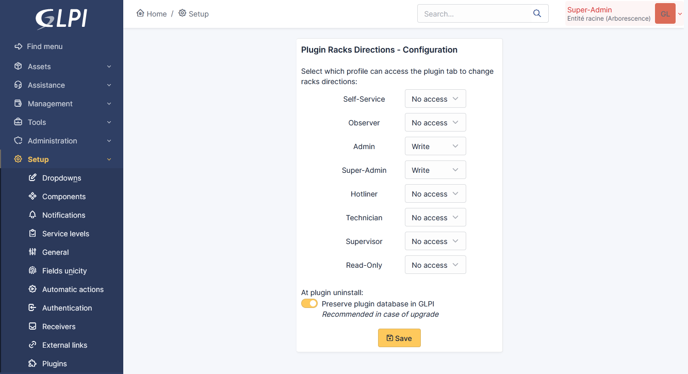
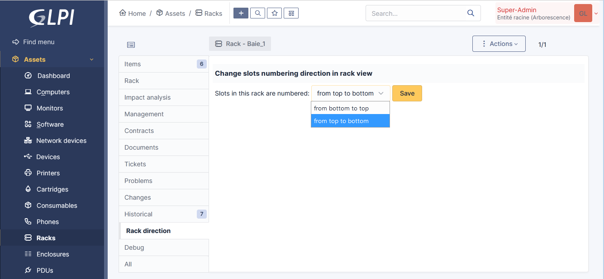
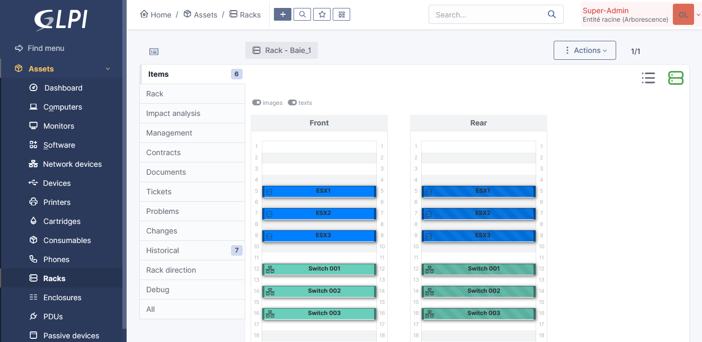

# GLPi RacksDirections Plugin

Download the plugin here : https://github.com/dim00z/RacksDirections/raw/main/misc/RacksDirections.zip

## Introduction

This plugin is intended to reverse slots numbering direction in racks views, if needed.

## Screenshots





## License


It is distributed under the GNU GENERAL PUBLIC LICENSE Version 3 - please consult the file called [LICENSE](https://raw.githubusercontent.com/dim00z/RacksDirections/main/LICENSE) for more details.

## Documentation

This plugin allows you to change slots numbering direction for each rack available in GLPI.
It's useful when you have to manage various types of racks in your IT infrastructure, and some of them are not numbered in the default direction.
This plugin allows you to modify the rack direction in GLPI to fit the real rack configuration.
You also can select the profiles which are allowed to change the racks directions.

This plugin is compatible with GLPI 10.0.0 => 10.0.9. Translations available in en_EN, fr_FR, es_ES. Up to you to add more.

This plugin needs to replace a GLPI core file ('/src/Item_Rack.php') with a custom one in order to work correctly.
It also adds a custom javascript file ('/js/rack.reverse.js') to GLPI.

It creates two new tables in the GLPI database, to store:
- the racks directions
- the different profiles rights

All its database tables and additionnal files are removed when uninstalling the plugin.
The original glpi file '/src/Item_Rack.php' is restored at the end of the uninstallation process.

## Installation

To install the plugin, unzip the files in the following directory:
'glpi/plugins/racksdirections/'
then install/enable it from the Setup/plugin panel. You need to configure profile rights in order to display the additionnal tab in racks views.

Or use git:

```sh
cd /my/glpi/deployment/main/directory/plugins
git clone https://github.com/dim00z/RacksDirections.git
```
